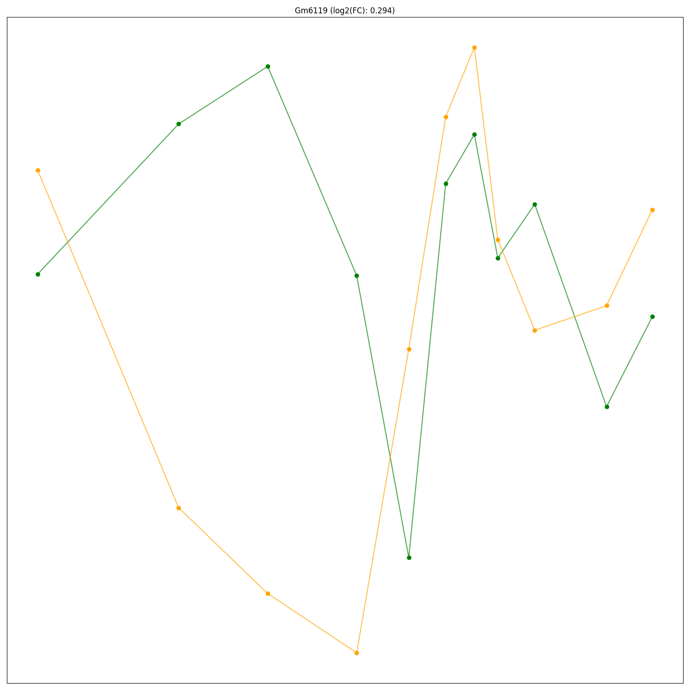

# Transient-Identification-Tool

## Overview
This repository contains a tool for identifying transients, pulses, and temporary changes over time.
Although originally designed for biological research, specifically for gene-expression analysis, the tool can be adapted for many other fields. 
It identifies genes or other vectorial changes over time that start at a certain level, increase or decrease, and return to a steady level—forming a "mountain" or "valley" shape.

## What is a Transient?
According to its [dictionary definition](https://www.dictionary.com/browse/transient), a "Transient" is something that lasts for only a short time, temporary.
In biology, many processes are transient, including those occurring during cell state transitions, which involve temporary changes in gene expression. Identifying genes with such transient behavior can help us better understand their roles and effects on cellular processes.

## What are the optional algorithms and what are their differences?
The tool offers two algorithms to identify transients, both based on aligning the "transient candidate" (e.g., expression levels of a single gene over time) with a linear line connecting its two ends. The premise is that the less successfully the candidate aligns with the line (i.e., the higher its absolute score), the more likely it is to represent a transient.

### The Euclidean algorithm:
This method measures the sum of all vertical distances between the candidate and the linear line (along the Y-axis, representing gene expression levels) at each time point (X-axis). Essentially, this algorithm detects "non-linearity" and may capture candidates (genes) with upward or downward trends that are not linear but are also not actual transients. Additionally, it may be subject to timeline-scale biases.
### The DTW algorithm:
"Dynamic Time Warping" [(DTW)](https://rtavenar.github.io/blog/dtw.html) is a similarity measure for time series that minimizes the Euclidean distance between aligned series by allowing flexible temporal alignment. Unlike the Euclidean method, DTW identifies "non-linear trends," making it less prone to false positives and potentially more accurate for detecting transients. However, it may also be stricter, missing some "true transients" compared to the Euclidean method.

<p align="center">
  
</p>

In the input parameters, you can choose your preferred method (as explained above). If unsure, it is recommended to run the tool twice using both algorithms.

## How is significance measured?
Significance is determined by identifying the "transient candidates" (e.g., genes) that score as significant according to the chosen method.
Using the "Monte Carlo" model, the candidate data is permuted thousands of times, and scores are calculated for each permutation with the chosen algorithm. The score of the actual candidate is then compared to the distribution of scores from these permutations. A candidate is considered significant, with a high probability of being transient, if its P-value is below 0.05 (after FDR adjustment for multiple hypotheses).

## Input and Usage
The tool requires the following inputs, provided as command-line arguments:

- `--df` (required): Path to the input data file (formatted as a tab-separated table, where rows represent transient candidates and columns represent time-ordered samples).
- `--algorithm` (required): Algorithm choice, either "Euclidean" or "DTW".
- `--monte_carlo`: Number of permutations for Monte Carlo simulations (default: 5000). Higher values increase accuracy but also runtime.
- `--adj_method`: Multiple testing correction method (default: "fdr_bh").
- `--time_stamps` (required): A space-separated list of time points corresponding to the samples.
- `--repeat1_cols` (required): A space-separated list of column indices representing the first set of repeats.
- `--repeat2_cols`: A space-separated list of column indices representing the second set of repeats (default: empty list).
- `--candidate_id_col`: Column index containing candidate identifiers (e.g., gene symbols) (default: 0).
- `--grid_name`: Desired filename for the output plot grid (just the name, without ".png"; default: "plot_grid.png").

### Example Command
An example dataset containing gene expression data from an RNA-seq experiment is included in this repository. To run the tool using this dataset:

```sh
python transient_identification_tool.py --df "example_gene_data_overtime.txt" --algorithm "Euclidean" --time_stamps 0 2 6 12 24 36 48 60 72 96 168 240 --repeat1_cols 2 4 6 8 10 12 14 16 18 20 22 24 --repeat2_cols 3 5 7 9 11 13 15 17 19 21 23 25
```

## Output
- **Processed Data**: The input file with additional columns containing calculated P-values and adjusted P-values.
- **Plots**: A PNG file visualizing the changes over time and fold changes for each significant candidate, for example:
<p align="center">
  
</p>
If no candidates are found to be significant, the program prints an appropriate message and exits.

## Installation and Dependencies
To use this tool, install the required Python packages:

- numpy
- pandas
- matplotlib
- seaborn
- dtaidistance
- statsmodels

Install them by running:
```sh
pip install -r requirements.txt
```

## Acknowledgments
* This tool was developed for a project in [Dr. Yaron Antebi's lab](https://www.weizmann.ac.il/molgen/Antebi/).
* This repository was created as part of a [Python programming course](https://github.com/szabgab/wis-python-course-2024-11?tab=readme-ov-file) at WIS.
